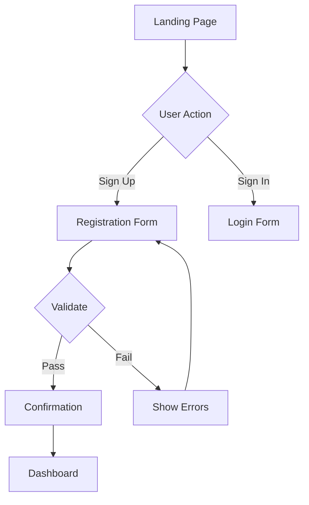

# Create Wireframes and Interaction Flows

## Purpose

Design wireframes, interaction flows, and component inventories based on user research insights and project requirements. Produce artifacts at the appropriate fidelity level (low, mid, or high) that communicate design intent to stakeholders and provide developers with clear implementation guidance.

## Prerequisites

- User research is available (personas, insights, pain points) -- either from a prior `ux-user-research` task or provided by the user.
- The target screens or views are identified (at minimum, a list of screen names).
- The primary use case or user journey is understood.
- If no user research exists, the task can still proceed with requirements-based design, but findings will be noted as assumption-driven.

## Steps

### 1. Define Wireframe Scope

Establish the boundaries of the wireframing effort.

**Determine fidelity level:**

| Level | Detail | Typical Effort |
|-------|--------|---------------|
| Low-Fidelity (Lo-Fi) | Boxes, labels, layout structure only | 30 min - 2 hours |
| Mid-Fidelity (Mid-Fi) | Layout, hierarchy, content placeholders, basic interactions | 4 - 8 hours |
| High-Fidelity (Hi-Fi) | Visual design, real content, detailed interactions, spacing specs | 1 - 3 days |

**Collect screen list:**
- Enumerate every screen or view to be wireframed.
- Identify the primary screen (most important user-facing view).
- Note any screens that share common layouts or components.

**Identify the primary use case:**
- What is the user trying to accomplish?
- What is the entry point and expected exit point?
- What are the key decision points along the way?

### 2. Review Research Inputs

Pull relevant context from user research (or project requirements if research is unavailable):

**From personas:**
- Who is the primary user?
- What is their technical proficiency?
- What are their goals and motivations?

**From insights:**
- What pain points should the design address?
- What behavioral patterns should the design support?
- What are known constraints (technical, business, accessibility)?

**From existing documentation:**
- PRD requirements relevant to the screens.
- Architecture constraints (API structure, data availability).
- Brand or style guidelines if applicable.

Document the design context:
```
Designing for: {persona_name}
Primary goal: {user_goal}
Key pain point: {relevant_pain_point}
Constraints: {technical_or_business_constraints}
```

### 3. Create Information Architecture

For each screen, build a content inventory -- an ordered list of every element that should appear:

**Element categories:**
- Navigation (global nav, breadcrumbs, tabs, sidebar).
- Page headers (title, subtitle, description).
- Content areas (primary content, secondary content, sidebar).
- Data displays (tables, cards, lists, charts, metrics).
- Forms (fields, labels, validation messages, submit buttons).
- Actions (buttons, links, CTAs, menus).
- Media (images, icons, video placeholders).
- Feedback (loading states, empty states, error states, success messages).
- Helper elements (tooltips, help text, progress indicators).

Example content inventory:
```
Screen: {screen_name}
---
- Page title
- Breadcrumb navigation
- Primary action button
- Filter controls (3 dropdowns)
- Data table (columns: Name, Status, Date, Actions)
- Pagination controls
- Empty state message (when no data)
- Error state message (when load fails)
```

### 4. Design Wireframe Layouts

Create the wireframes at the specified fidelity level.

#### Low-Fidelity Wireframes (ASCII/Text-Based)

Use ASCII art to represent layout structure:

```
+----------------------------------------------------------+
|  [Logo]                    [Nav1] [Nav2] [Nav3] [Profile] |
+----------------------------------------------------------+
|                                                           |
|  {Page Title}                                             |
|  =========================================================|
|                                                           |
|  +----------------+  +----------------+  +----------------+|
|  | {Metric 1}     |  | {Metric 2}     |  | {Metric 3}    ||
|  | [Value]        |  | [Value]        |  | [Value]       ||
|  | [Label]        |  | [Label]        |  | [Label]       ||
|  +----------------+  +----------------+  +----------------+|
|                                                           |
|  {Section Title}                             [View All]   |
|  ---------------------------------------------------------|
|  [ ] {Item 1} - {Description}              [Action]       |
|  [ ] {Item 2} - {Description}              [Action]       |
|  [ ] {Item 3} - {Description}              [Action]       |
|                                                           |
|  [+ Primary Action Button]                                |
|                                                           |
+----------------------------------------------------------+
|  {Footer Links} | {Copyright} | {Privacy}                 |
+----------------------------------------------------------+
```

Create one wireframe per screen using this format.

#### Mid-Fidelity Wireframes

Extend low-fidelity with:
- Component type annotations (e.g., "Dropdown", "Modal", "Toast").
- Content hierarchy indicators (H1, H2, body text, caption).
- Interaction annotations (e.g., "Opens modal on click", "Filters table on change").
- State indicators (default, hover, active, disabled, loading, error, empty).

**Mid-Fidelity Component Checklist:**
- [ ] Navigation (global, contextual)
- [ ] Page title and breadcrumbs
- [ ] Content areas (primary, secondary, sidebar)
- [ ] Forms (labels, fields, validation, buttons)
- [ ] Data displays (tables, cards, lists)
- [ ] Images and media placeholders
- [ ] CTAs and action buttons
- [ ] Loading states
- [ ] Empty states
- [ ] Error states

#### High-Fidelity Wireframes

Extend mid-fidelity with:
- Specific content (real text, real labels, real data examples).
- Spacing and sizing specifications (using a base grid unit).
- Color and typography references (if brand guidelines exist).
- Complete state documentation for every interactive element.

### 5. Document Interaction Flows

For each primary use case, create a flow diagram showing the user path through the screens:

**Flow notation:**
```
[Screen/State] --> [User Action] --> [Next Screen/State]
                                 --> [Error State] (on failure)
```

**Example interaction flow:**
```
[Landing Page]
    |
    v
[Click "Sign Up"]
    |
    v
[Registration Form]
    |
    v
[Fill fields + Submit]
    |
    +--> [Validation passes] --> [Confirmation Screen] --> [Dashboard]
    |
    +--> [Validation fails] --> [Show inline errors] --> [User corrects] --> [Re-submit]
```

For complex flows, use Mermaid syntax for machine-readable diagrams:



Document one flow per primary use case. Include alternate paths (error, cancel, back).

### 6. Annotate Design Decisions

For each wireframe, add annotations explaining non-obvious design choices:

**Annotation types:**
- **Functionality:** "Clicking this button opens a confirmation modal."
- **Content:** "Display the user's first name from their profile data."
- **State:** "Button is disabled until all required fields are valid."
- **Business rule:** "Only visible to users with premium accounts."
- **Accessibility:** "Focus trap when modal is open. Escape key closes modal."
- **Performance:** "Lazy load images below the fold. Paginate results at 20 per page."
- **Analytics:** "Track click event for conversion funnel."

### 7. Build Component Inventory

List all unique UI components identified across all wireframes, organized by complexity:

**Atoms (basic building blocks):**
- Buttons (primary, secondary, destructive, ghost, icon-only).
- Inputs (text, email, password, number, search, textarea).
- Labels, badges, avatars, dividers, icons.

**Molecules (composed from atoms):**
- Form field (label + input + helper text + error message).
- Search bar (input + icon + button).
- Card header (avatar + title + subtitle).
- Navigation item (icon + label + badge).
- Stat display (label + value + trend indicator).
- Dropdown (button + menu items).
- Toast notification (icon + message + dismiss).
- Empty state (icon + title + description + CTA).

**Organisms (composed from molecules):**
- Header (logo + navigation + search + profile).
- Form (multiple fields + submit button + validation).
- Data table (headers + rows + pagination + sorting).
- Card (header + content + footer + actions).
- Modal (overlay + header + body + footer + close).

For each component, note:
- Name and description.
- Variants (e.g., primary button, secondary button).
- States (default, hover, active, disabled, loading, error).
- Props or configuration (what data it needs).

### 8. Define Responsive Behavior

Document how wireframes adapt across breakpoints:

**Breakpoints:**
```
Mobile:  < 640px
Tablet:  640px - 1024px
Desktop: > 1024px
```

**Spacing system (base unit: 4px):**
```
xs:  4px
sm:  8px
md:  16px
lg:  24px
xl:  32px
2xl: 48px
3xl: 64px
```

For each screen, note:
- What changes between mobile and desktop (column count, navigation style, element visibility).
- Touch target minimums (44x44px for mobile).
- Content that collapses, hides, or reflows.

### 9. Prepare Developer Handoff Package

Compile all wireframe artifacts into a structured handoff package:

**Required deliverables:**
1. `wireframes/` -- all screen wireframes (ASCII or structured text).
2. `flows.md` -- interaction flow diagrams for all primary use cases.
3. `component-inventory.md` -- complete component list with variants and states.
4. `annotations.md` -- design decisions and behavioral notes.
5. `handoff-summary.md` -- overview for developers with key decisions, spacing system, and breakpoints.

**Optional deliverables:**
6. `responsive-notes.md` -- breakpoint behavior per screen.
7. `measurements.md` -- detailed spacing and sizing specifications.
8. `state-catalog.md` -- documentation of all component states (loading, empty, error, success).

Save all deliverables to: `{output_directory}/wireframes/{project_name}/`

### 10. Present Results

Inform the user:
- Number of screens wireframed and at what fidelity level.
- Number of interaction flows documented.
- Number of unique components in the inventory.
- Summary of key design decisions.
- Location of the handoff package.
- Suggested next steps:
  - Generate AI UI prompts for rapid prototyping (v0.dev, Lovable).
  - Create frontend specification from the wireframes.
  - Begin implementation using the component inventory.

## AI UI Generation Prompts

After creating wireframes, generate prompts for AI prototyping tools:

**v0.dev Prompt Template:**
```
Create a [Component Name] component with:
- [Feature 1]
- [Feature 2]
- [Feature 3]

Style: [Modern/Minimal/Bold]
Colors: [Primary/Secondary colors]
Framework: React + TypeScript + Tailwind CSS
Accessibility: WCAG AA compliant
```

**Lovable Prompt Template:**
```
Build a [Screen Name] page featuring:
- [Section 1 description]
- [Section 2 description]
- [Section 3 description]

Layout: [Grid/Flex/Stack]
Mobile-responsive: Yes
Dark mode: [Yes/No]
```

## Error Handling

- **No research inputs available:** Proceed with requirements-based design. Add a prominent note that designs are assumption-driven and recommend user research validation.
- **Screen list not provided:** Ask the user. If unavailable, infer from requirements (PRD, stories). If nothing is available, HALT.
- **Conflicting requirements:** Document the conflict in annotations, present both options, and ask the user to decide.
- **Fidelity level not specified:** Default to Low-Fidelity. Low-fidelity is fastest and most appropriate for early exploration.
- **Too many screens (>20):** Suggest prioritizing the top 5-10 screens first. Warn that the full set will take significant effort.
- **Missing persona data:** Use a generic "target user" and note the gap. Recommend completing user research before finalizing designs.

## Best Practices

### Visual Hierarchy
- Larger = more important.
- Bold = action or emphasis.
- Color = status or category.
- Proximity = related items.

### Consistency
- Use same components throughout.
- Maintain spacing patterns.
- Follow established navigation.
- Repeat interaction patterns.

### Accessibility
- Sufficient contrast (4.5:1 minimum).
- Clear focus indicators.
- Logical tab order.
- Alt text for images.
- Form labels and error messages.

### Mobile-First
- Design for smallest screen first.
- Progressive enhancement for larger screens.
- Touch targets minimum 44x44px.
- Avoid hover-only interactions.

### Common Pitfalls
1. **Too much detail too early** -- start lo-fi, iterate to hi-fi.
2. **Designing in isolation** -- share early, get feedback often.
3. **Ignoring edge cases** -- design empty states, errors, loading.
4. **Inconsistent patterns** -- reuse components, do not reinvent.
5. **No mobile consideration** -- design responsive from the start.

## Notes

- Start with low-fidelity and iterate upward. It is faster to explore layout options in ASCII art than in detailed specifications.
- Share wireframes early and often. Quick feedback loops prevent wasted effort on designs that miss the mark.
- Always design for the three key states: the happy path (everything works), the empty state (no data yet), and the error state (something went wrong).
- Use the component inventory to avoid designing the same element differently on different screens. Consistency reduces development effort.
- For AI-assisted prototyping (v0.dev, Lovable, etc.), the wireframes and component inventory serve as excellent input for prompt generation.
